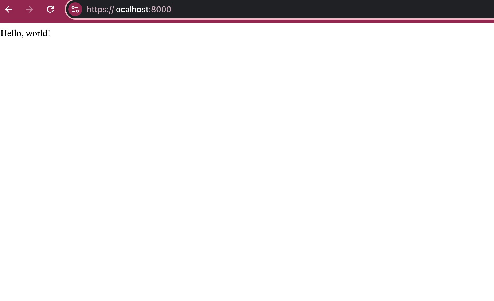

# http-https

# SSL Certificate Installation and Configuration

## 1. Acquire and Install the SSL Certificate

### Step 1: Generate a Private Key and Certificate Signing Request (CSR) using Let's Encrypt platform ["https://letsencrypt.org/docs/certificates-for-localhost/"]
- Open a terminal and run:

```bash
openssl req -x509 -out localhost.crt -keyout localhost.key \
  -newkey rsa:2048 -nodes -sha256 \
  -subj '/CN=localhost' -extensions EXT -config <( \
   printf "[dn]\nCN=localhost\n[req]\ndistinguished_name = dn\n[EXT]\nsubjectAltName=DNS:localhost\nkeyUsage=digitalSignature\nextendedKeyUsage=serverAuth")
```

### Step 2: Install the generated SSL Certificate
- Place the localhost.crt and localhost.key files in a secure directory on your server.

## 2. Configure Web Server
-Modify your server to use HTTPS:

```javascript
    const https = require('https');
    const fs = require('fs');
    const express = require('express');

    const app = express();

    const options = {
        key: fs.readFileSync('path/to/localhost.key'),
        cert: fs.readFileSync('path/to/localhost.crt')
    };

    https.createServer(options, app).listen(8000, () => {
    console.log('Server running on https://localhost:8000');
    });
```

## 3. Compare HTTP and HTTPS
- Access the Website via HTTP


- Access the Website via HTTPS


## 4. Install localhost.crt as a Trusted Root Certificate

- Install localhost.crt in your list of locally trusted roots.
- Access the Website via HTTPS again




